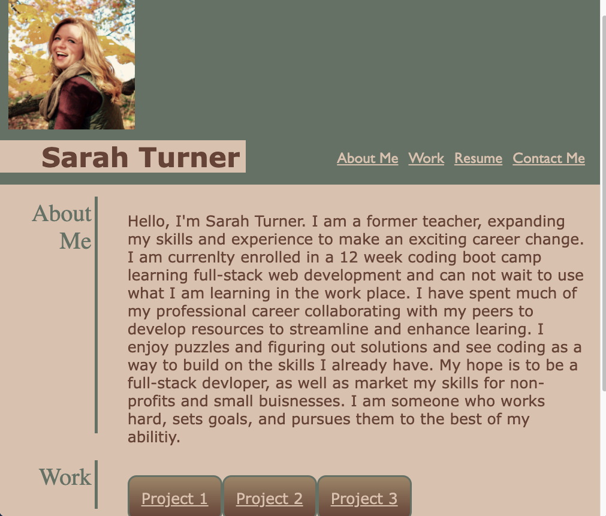

# portfolio

## Description
This project was to create a portfolio that will provide information to our future employers about us, our work, and how to contact us. This portfolio has about me, work, resume, and contact me sections, with the work section eventually having links to our work that will deploy into other pages when cicked. 

## Screen-Shot 

## Web-Page
If you click on the navigation links at the top of the webpage (about me, work, resume, contact me) they will take you to that section on the portfolio page. 

If you hover over the projects in the work section, the one you are hovering over will get bigger. Eventually when you click on a project it will take you to a new webpage with the project on it. 

If you click on  "click here for resume link" it will take you to a new webpage with my current resume on it.

If you go to the contact me section it has my phone number and email and links to my linkedin website and github webpage.

## Links

<a href="https://github.com/smturner/portfolio">GitHub Respository</a>

<a href="https://smturner.github.io/portfolio/">Deployed Application</a>